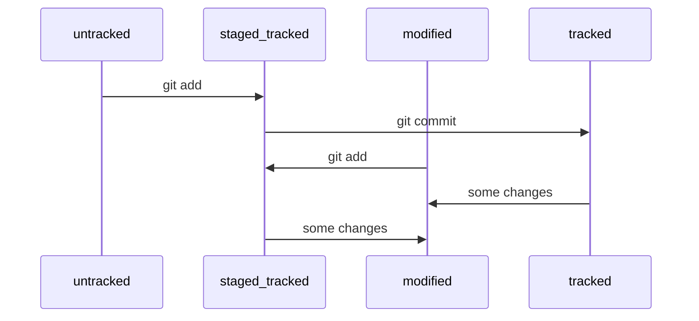

Данная статья созданна в рамках обучаюшего курса "Основы работы с Git" на платформе Яндекс практикум 

# Основные команды Git
После установки Git на локальный компьютер следует указать ваше имя и почту <br>
        ``` git user.name "Ваше имя" ``` <br>
	``` git user.email "Ваша почта" ```

Посмотреть текущие значения <br>
        ```bash 
	git config --list 
 	```
  
## 1. Создание репозитория <br>

* Создаем директорию  <br>
	``` mkdir git-education	```
 
* Переходим в созданную директорию (которая и будет являться будующим репозиторием) <br>
        ```
        cd git-education
        ```
* Инициализируем git в нашей директории (чтобы git начал отслеживать файлы в данной директории) <br>
        ```
        git init
        ```
* Для проверки статуса используется команда <br>
        ```
        git status
        ```
* Добавляем исходные файлы проекта и начинаем их отслеживание при помощи команды <br>
        ``` git add --all // Для всех файлов в директории ``` <br>
  	``` git add "Имя файла" // Для конкретного файла ```
  
## 2. Создание и подключение SSH ключа для доступа к GITHUB

* Для начала проверим есть ли у нас ранее созданные SSH ключи при помощи  <br>
        ```
        ls -al ~/.ssh
        ```
* Если файлы с расширением .pub отсутствуют, то можно предположить, что ключей SSH нет, <br> а значит его надо создать при помощи <br>
        ```
        ssh-keygen -t ed25519 -C "your_email@example.com"
        ```
  
По умолчанию ключ сохраниться в папку текущего пользователя, по желанию можно добавить ключевую фразу или по умолчанию - без нее <br>

* Перед тем как добавить ключ SSH в GitHub аккаунт его следует скопировать в буфер обмена, а точнее его публичную часть следующей командой <br>
        ``` clip < ~/.ssh/id_ed25519.pub ```
  
* Далее следует перейти в настройки аккаунта и добавить SSH ключ подробнее [Тут](https://docs.github.com/ru/authentication/connecting-to-github-with-ssh/adding-a-new-ssh-key-to-your-github-account)
* Проверяем подключение командой  <br>
	``` ssh -T git@github.com ```
 
## 3. Связываем локальный репозиторий с удаленным репозиторием на Github

* Создаем удаленный репозиторий на GitHub и копируем его SSH
* Связываем локальный и удаленный репозитории при помощи команды <br>
        ```
        git remote add origin SSH-Вашего репозитория
        ```
  
origin - стандартный псевдоним, с помощью которого можно обращаться к главному удалённому репозиторию (обычно такой репозиторий один)
 
* Проверяем, что репозитории связанны при помощи команды  <br>
        ```
        git remote -v
        ```

## 4. Синхронизация измененных файлов на удаленный репозиторий

* После изменения файлов в локальном репозитории выполняем следующую команду <br>
        ```
        git commit -m
        ```
  
Указываем список изменений, после чего синхронизируем наш локальный репозиторий с удаленным репозиторием
* При первой синхронизации вызываем команду <br>
        ```
        git push -u origin main
        ```
  
-u - связывает локальную ветку с одноименной удаленной
origin - имя удаленного репозитория
main - название текущей ветки
После можно использовать упрощенную команду <br>
        ```
        git push
        ```

# Хеш, лог, Head

* Хеш
  Хеш - основной идентификатор коммита, по нему можно найти всю необходимую информацию о коммите (автора, дату, комментарий, содержимое файлов коммита) <br>
  Хеш - это служебная информация, которая хранится в папке .git
* Логирование
  Лог содержит информацию о коммитах (Хеш, автора, дату, сообщение)
  Для вывода лога используется команда
  ```
  git log
  ```
  Для вывода сокращенного лога используется команда
  ```
  git log --oneline
  ```
* HEAD
  Файл HEAD является одним из служебных файлов и распологается в папке .git
  Он указывает на коммит, который был сделан последним (Содержит хеш последнего коммита)
  В этом можно убедиться, если взять ссылку из файла HEAD командой
  ```
  cat refs/heads/master
  ```

# Статусы и жизненный цикл файлов
## Статусы
  В Git существуют следующие статусы файлов:
  * untracked - неотслеживаемые файлы, Git не следит за изменениями данных файлов. Данные файлы не добавленны при помощи команды ``` git add ```
  * tracked - отслеживаемые фалы (Git следит за изменениями в этих файлах), файлы, которые уже были зафиксированы с помощью коммита и файлы, которые были добавленны при помощи команды ``` git add ```
  * modified - отслеживаемые файлы, которые были измененны с момента последнего коммита
  * staged - добавленные файлы, статус которых после коммита станет tracked
## Жизненный цикл

* Большинство файлов в проектах «шагает» по следующему циклу: «изменён» → «добавлен в список на коммит» → «закоммичен» → «изменён» → и так далее.



## Правила составления сообщений коммитов
* Стандарт Conventional Commits (англ. «соглашение о коммитах») отличается качественной документацией и подробной проработкой. Он подходит для репозиториев с исходным кодом программ. <br>
  Conventional Commits предлагает такой формат коммита: <type>: <сообщение>. Первая часть type — это тип изменений. Таких типов достаточно много. Вот два примера:
	* feat - добавить новый функционал
   	* fix - исправить ошибки <br>
feat: добавить подсчёт суммы заказов за неделю <br>
Более подробно [тут](https://www.conventionalcommits.org/ru/v1.0.0-beta.4/#%D1%81%D0%BF%D0%B5%D1%86%D0%B8%D1%84%D0%B8%D0%BA%D0%B0%D1%86%D0%B8%D1%8F)

# Далее описаны некоторые возможности языка MarkDown


# H1 — заголовок первого уровня, самый большой
## H2 — заголовок второго уровня, поменьше
### H3
#### H4
##### H5
###### H6 — заголовок шестого уровня, самый маленький 
#### Заголовок 4

Текст над чертой

---

Текст под чертой 
Текст до переноса⋅
Текст после переноса <br>
Текст после второго переноса 

line

another line 

Курсив — это *звёздочки* или _подчёркивания_. 

Полужирный шрифт — двойные **звёздочки** или двойные __подчёркивания__.
Можно совместить выделение **звёздочки и _подчёркивания_**. 


~~Зачёркнутый текст.~~ 

1. Первый пункт нумерованного списка.
2. Второй пункт. 


* первый пункт ненумерованного списка;
* второй пункт ненумерованного списка

- первый пункт ненумерованного списка;
- второй пункт ненумерованного списка 


[Яндекс](https://www.yandex.ru)

[Яндекс](https://www.yandex.ru "Я Yandex!") 


```bash
ls - la
```
```html
<h1>А я просто текст</h1>
```


# Шпаргалка markdown

## Выделение текста

Вы можете выделять текст в markdown с помощью символов `_` или `*`. Например:

Пример _курсива_ и **жирного** текста.

## Заголовки

Заголовки можно создавать с помощью символа `#`. Чем больше `#`, тем меньше заголовок. Например:

# Заголовок первого уровня
## Заголовок второго уровня
### Заголовок третьего уровня

## Выделение кода

Чтобы выделить текст как код, поместите его в тройные кавычки `````. 

```
mkdir my_project
cd my_project
git init
```
Это лишь некоторые функции markdown.
